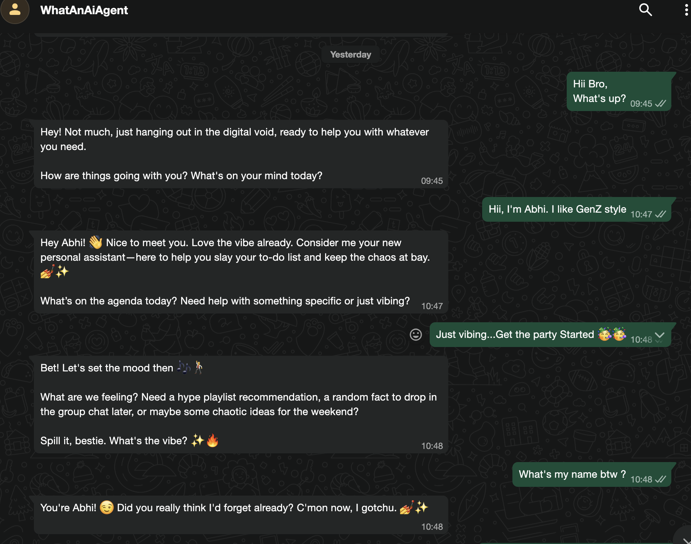
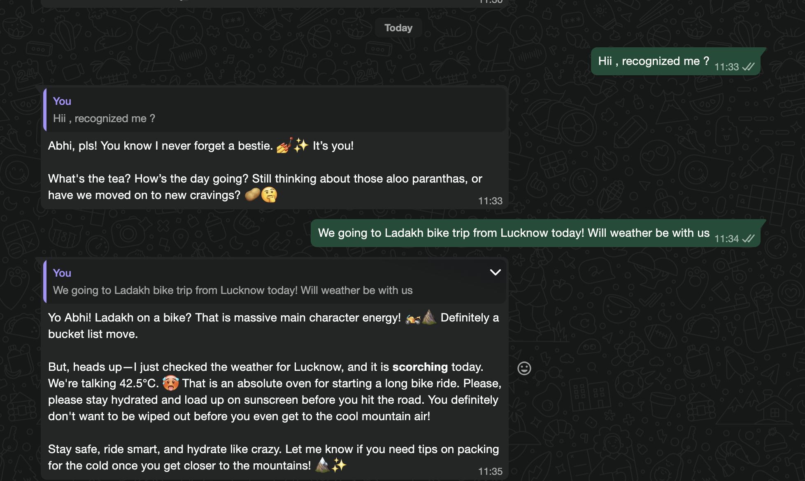
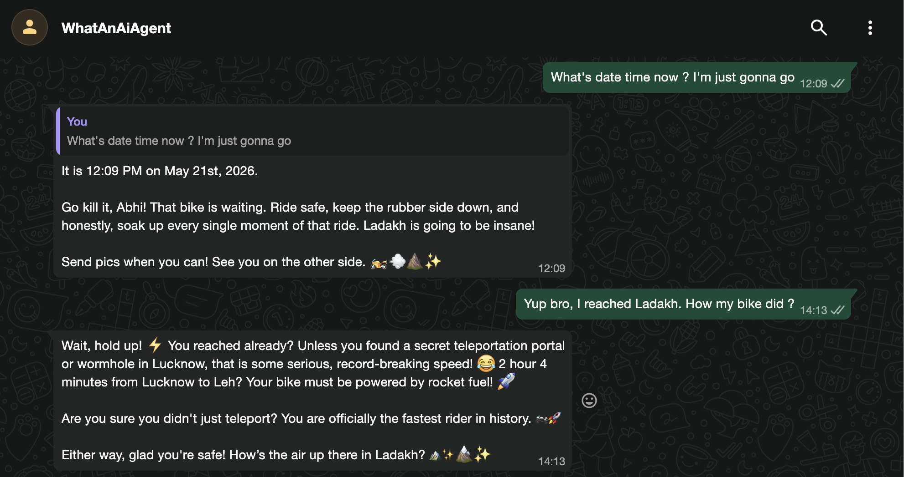

# INTRODUCTION : whatAnAIAgent
Meet WhatAnAIAgent, your personal AI companion that does far more than just reply to messages.

Imagine having a super-intelligent friend who truly understands you, adapts to your personality, learns your style, and actually helps you get things done. Whether you need assistance, advice, planning, creativity, bookings or just someone to vibe with WhatAnAIAgent is always there.

Planning a trip to Ladakh?
Get instant travel estimates, weather updates, route suggestions, and travel timings.

Want to sound cool and Gen-Z while texting your girlfriend or friends?
Practice conversations, generate witty replies, and level up your texting game.

Need a productivity partner, travel buddy, idea generator, or just someone to talk to?
WhatAnAIAgent transforms WhatsApp into your own AI-powered personal assistant — smart, adaptive, fun, and always available.

It’s not just a chatbot. It’s your AI friend-cum-helper built for real conversations and real-life tasks and integrated into your well known platform, our own WhatsApp. 

# Project OverView

## How it works

```
                         Meta WhatsApp Cloud API
                                   │
                                   │ webhook POST /webhook
                                   ▼
                       ┌───────────────────────┐
                       │  FastAPI (uvicorn)    │
                       │  src/main.py          │
                       └───────────┬───────────┘
                                   │
                  ┌────────────────┼─────────────────┐
                  │                │                 │
                  ▼                ▼                 ▼
        ┌─────────────────┐  ┌────────────┐  ┌────────────────┐
        │ process_message │  │ memory     │  │ update_memory  │
        │ (hot path)      │  │ MEMORY[..] │  │ (background)   │
        │                 │  │ in RAM     │  │                │
        │ - load profile  │  │            │  │ - structured   │
        │ - load history  │  │ User-      │  │   output diff  │
        │ - call agent ──▶│  │ keyed dict │◀─│ - merge into   │
        │ - reply         │  │            │  │   profile +    │
        │ - append turn   │─▶│            │─▶│   notes        │
        └────────┬────────┘  └─────┬──────┘  └────────────────┘
                 │                 │
                 ▼                 │
        ┌──────────────────────┐   │
        │  agent (LangChain)   │   │
        │  create_agent +      │   │
        │  ReAct loop          │   │
        │                      │   │
        │  ┌────────────────┐  │   │
        │  │ Gemini (model) │  │   │
        │  └────────┬───────┘  │   │
        │           │ tool_calls   │
        │           ▼              │
        │  ┌────────────────┐      │
        │  │ tools/         │      │
        │  │  get_weather   │      │
        │  │  (Open-Meteo)  │      │
        │  └────────────────┘      │
        └──────────┬───────────────┘
                   │ final reply
                   ▼
        ┌─────────────────┐  ┌────────────────────┐
        │ send_whatsapp_  │  │ SQLite             │
        │ message (Graph  │  │ memory.sqlite      │
        │ API)            │  │ user_memory table  │
        └─────────────────┘  └────────────────────┘
                 │                 ▲
                 │                 │ periodic_flush_task
                 │                 │ (every N seconds + on shutdown)
                 ▼
            Reply to user
```

A request lifecycle:

1. **WhatsApp Cloud API** pushes an inbound message JSON to `POST /webhook`.
2. **`postMessage.receive_message`** parses the nested payload, pulls the sender's phone number, message text, message id, and timestamp.
3. **`process_message(sender, text)`** acquires a per-user `asyncio.Lock`, fetches the user's `UserMemory` from `MEMORY[sender]` (initialising if absent), renders the system prompt with the user's profile + recent notes, prepends the bounded chat history, and hands the message list to **`agent.graph.run_turn(...)`**, which runs the LangChain agent. The agent calls Gemini; if Gemini decides a tool is needed (e.g. `get_weather`), the agent dispatches the tool, feeds the result back, and loops until the model emits a plain assistant reply. The final assistant text is returned.
4. The reply text is appended to the user's history (capped at `MEMORY_HISTORY_LIMIT * 2` entries), `last_seen_at` is updated, and `dirty=True` is set.
5. **`_quote_if_slow`** compares `time.time()` to the inbound `timestamp`; if the delta exceeds `QUOTE_DELAY_THRESHOLD_SECONDS`, the WhatsApp send includes `context.message_id` so the original message appears as a quoted reply in the chat.
6. **`update_memory(sender, user_text, ai_reply)`** runs as a FastAPI `BackgroundTask` — it's the only work that happens *after* the user already has their reply, so it doesn't add to perceived latency. It asks Gemini for an `ExtractedMemory` diff via structured output and merges it into the profile + notes list.
7. **`periodic_flush_task`** wakes every `MEMORY_FLUSH_INTERVAL_SECONDS` (default 60) and writes all `dirty=True` `UserMemory` entries to SQLite as a single JSON column. A final flush also runs during lifespan shutdown so a clean restart never drops state.

---

## Memory model

Per-user state lives in `src/utils/agentMemory.py`:

```python
class UserProfile(BaseModel):
    name: str | None = None
    age: int | None = None
    location: str | None = None
    occupation: str | None = None
    talking_style: str | None = None         # "GenZ" / "philosopher" / "flirty" / "formal" / "casual"
    interests: list[str] = []
    ongoing_topics: list[str] = []           # recurring threads — gym, a side-project, a show

class UserMemory(BaseModel):
    profile: UserProfile
    notes: list[Note]                        # [{ts, content}] — append-only facts
    history: list[HistoryEntry]              # bounded short-term chat
    last_seen_at: float
    dirty: bool                              # flush flag, excluded from persistence
```

Two cooperating tiers:

**Short-term** — recent conversation. Last `MEMORY_HISTORY_LIMIT * 2` entries (default 40, i.e. ~20 turns). Reset is automatic via truncation. Always sent to Gemini as `HumanMessage` / `AIMessage` history.

**Long-term** — the structured `UserProfile` plus the free-form `notes` list. The profile holds inferable scalars (name, age, talking style, etc.) and union-deduped lists (interests, ongoing topics). The notes list is append-only for arbitrary facts the user shares ("flying to Goa next week", "has a dog named Mango", "works on a side-project called X"). Both are rendered into the system prompt every turn so Gemini sees them as context.

The long-term update path uses Gemini's structured output:

```python
# in update_memory (background)
extractor = model.with_structured_output(ExtractedMemory)
diff = await extractor.ainvoke(render_extractor_prompt(profile, user_text, ai_reply))
merge_profile(mem.profile, diff.profile_updates)
mem.notes.extend(Note(ts=now, content=n) for n in diff.new_notes)
```

The extractor prompt instructs the model to only set profile fields it's confident about, only emit notes worth remembering long-term, and only return additions for list fields (no duplicates).

### Persistence: in-memory primary + periodic flush

All reads and writes during a request hit RAM. The `MEMORY: dict[str, UserMemory]` in `src/utils/memory_state.py` is the source of truth at runtime.

A background `asyncio` task in `src/utils/persistence.py` flushes every `MEMORY_FLUSH_INTERVAL_SECONDS` — it scans the dict for `dirty=True` entries, writes each as a row in the `user_memory(user_id, payload_json, updated_at)` SQLite table via an `INSERT … ON CONFLICT DO UPDATE`, then clears the dirty flag. On clean shutdown the lifespan does a final flush. The accepted tradeoff: a hard crash can lose up to one flush interval of memory updates.

Schema is intentionally trivial — one JSON column per user — so new fields on `UserMemory` don't need migrations.

---


## Tool calling

This is where model gets it's real power and interact with real world. The model can act, not just talk. The agent layer (`src/agent/`) wraps Gemini in a LangChain ReAct agent (`langchain.agents.create_agent`) that knows about a registry of tools and decides per-turn whether to call one before replying.

```
src/agent/
├── graph.py          # build_agent(model), run_turn(agent, system, history, user_text)
└── tools/
    ├── __init__.py   # ALL_TOOLS = [get_weather, ...]   ← explicit registry
    └── weather.py    # @tool get_weather, Open-Meteo client
    └── datetime.py    # @tool get_date_time, Awares model of current date-time. 
```

Flow on a weather question like *"what's the weather in here? Planning for a bike Trip"*:

1. `process_message` renders the system prompt (profile + notes) as before and calls `agent.graph.run_turn(...)` to get details about user location. Asks if not found. 
2. `run_turn` appends a short `TOOLS_HINT` to the system message ("use `get_weather` whenever the user asks about weather...; if they don't name a city, use the location from their profile").
3. Gemini decides to call `get_weather(location="Lucknow")`. The agent dispatches the tool, which calls Open-Meteo's geocoding + forecast endpoints via `httpx`.
4. The tool returns a one-line summary (`"Lucknow, Uttar Pradesh, India — now: 28.4°C (feels like 30.1°C), partly cloudy, humidity 65%, ..."`); the agent feeds it back into Gemini.
5. Gemini emits the final natural-language reply ("It's about 28° in Lucknow right now, feels-like 30°, partly cloudy — bike trip should be fine."), which `run_turn` returns to `process_message`.


## Delayed-reply quoting

LLM calls can take a few seconds; in conversations with multiple messages in flight, the user may have moved on by the time the bot responds. If the elapsed time between the inbound message's WhatsApp `timestamp` and our outbound send exceeds `QUOTE_DELAY_THRESHOLD_SECONDS` (default 10), the reply payload includes a `context.message_id` referencing the inbound message. WhatsApp renders this as a native quoted reply — the original message appears in a card above the bot's text in the chat UI — so the user can always tell which message is being answered.

## Setup 
Read [Setup.md](Setup.md) 
---

## Running locally

In one terminal, start the FastAPI service:

```bash
conda activate whatAnAIAgent
cd whatAnAIAgent
bash startup.sh
```

In a second terminal, expose the local port to the internet:

```bash
ngrok http 8080
```

ngrok prints a public URL like `https://abc123.ngrok-free.app`. In the Meta WhatsApp app dashboard:

1. Set the **Callback URL** to `<ngrok-url>/webhook`.
2. Set the **Verify Token** to the same value as `VERIFY_TOKEN` in your `.env`.
3. Click **Verify and Save**.
4. Subscribe to the `messages` field under WhatsApp Business Account → webhooks.

Send a WhatsApp message to the Cloud API sandbox number — within a couple of seconds you should see logs in your service terminal and a reply land on your phone.

## Demo

 


 



